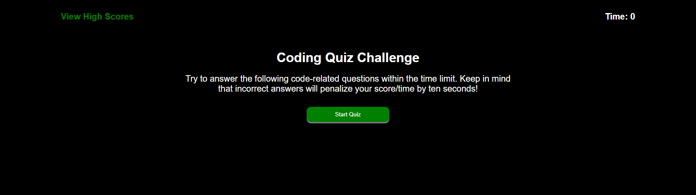

# Coding Quiz Challenge

## Description

I was tasked with creating a working quiz with questions about coding with a timer function and a fully operational high scores list.

## Installation

I used arrays, functions, and event viewers to allow the user to click on the answers of each question while affecting the timer and letting you know if the answer was correct or not.

## Usage

To use this page, you would click the start button. Five questions would appear one after the other in a randomized order. A timer would start counting down from 50. Each correct answer would display as correct and add 10 seconds to the timer. Each wrong answer would display as wrong and subtract 10 seconds to the timer. When finished, the remaining time is your score and you are then able to input your initials for the high score list. The high score list is obtainable at any point and has a clear list option.

## Credits

HTML, CSS, and JavaScript code were originally used by [Achigas](https://github.com/Achigas/CodeQuiz-Challenge4) but were polished by me with changes made to the colors, the questions, button and font sizes, and functions to better fit the requirements of the assignment.

https://github.com/MrMessyFace/04-coding-quiz-challenge